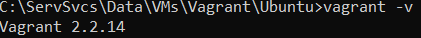

# devops-netology
## Репозиторий для домашнего задания по курсу "DevOps-инженер"
## Яковенко Михаил

  https://github.com/smirknt/devops-netology

---
## Домашнее задание к занятию "3.1. Работа в терминале, лекция 1"

1. Установлен Oracle VirtualBox:

    

1. Установлен Hashicorp Vagrant:
   
   

1. Настроен терминал на базе puttyng, настроена работа wsl2 параллельно с Virtualbox, аппаратная виртуализация активирована

1. Создана директория для конфигурации vagrant. Создан `vagrantfile` с помощью команды `vagrant init bento/ubuntu-20.04` 

    ```ruby
    Vagrant.configure("2") do |config|
      config.vm.box = "bento/ubuntu-20.04"
    end
    ```

    Затем с помощью команды `vagrant up` предпринята попытка поднять виртуальную машину на основе box'a `bento/ubuntu-20.04`, однако данный box не скачивался с серверов vagrant:

    

    Поэтому вместо него был выбран box `ubuntu/focal64` и на его основе поднята виртуальная машина:
    ```console
    vagrant init ubuntu/focal64
    vagrant up
    ```
1. В VirtualBox была поднята машина со следующими ресурсами, выделенными vagrant'ом по умолчанию:

    

1. Внес изменения в vagrantfile, уменьшив количество выделенных процессоров до 1, а объем памяти увеличив до 2048 Мб:
    ```ruby
    Vagrant.configure("2") do |config|
      config.vm.box = "ubuntu/focal64"
      config.vm.provider "virtualbox" do |vb|
        vb.memory = "2048"
	    vb.cpus="1"
      end
    end
    ```

1. Подключился к виртуальной машине, используя команду `vagrant ssh`:

    

1. Из вывода команды `man bash` получил:

    - на `862` строке идет информация о переменной HISTSIZE, которой можно задать глубину истории команд введенных в bash
    - директива `ignoreboth` является сокращением для директив `ignorespace,ignoredups`. Директива `ignorespace` определяет, что в истории не будут хранится строки команд, которые начинаются с символа пробела. Директива `ignoredups` определяет, что в истории не будут сохранятся строки команд, которые полность. дублируют предыдущие команды.

1. Фигурные скобки `{}` используются в качестве:
   
   - группировки команд (создается блок команд), команды выполняются в текущем окружении bash и должны отделяться друг от друга точкой с запятой (`;`) или символом новой строки (строка `257` в `man bash`)
   - используется для раскрытия последовательности, перечисленной в скобках через пробел. Например, `f{1,2}` раскрывается в `f1 f2` (строка `1099` в `man bash`).

1. Команда для создания 100 000 файлов будет следующая: `touch {1..100000}`. При попытке выполнить подобную команду лдя 300 000 файлов `touch {1..300000}` при раскрытии скобок наталкивается на ограничение размера аргументов командной строки: `-bash: /usr/bin/touch: Argument list too long`

1. Конструкция [[ -d /tmp ]] возвращает `0`, если файл `/tmp` существует и является директорией, и возвращает `1` в противном случае.

1. Выполняем следующие команды:
   ```console
   mkdir /tmp/new_path_directory
   cp /bin/bash /tmp/new_path_directory/
   PATH=/tmp/new_path_directory:$PATH
   type -a bash
   ```    
   Получаем вывод: 
   

1. Различие между командами `at` и `batch` состоит в том, что `at` задает команды, которые будут однократно выполнены в определенное время, а команда `batch` задает команды, которые быдут выполнены тогоа, когда загрузка системы упадет ниже определенного значения (по умолчанию 1.5).

1. Завершаем выполнение виртуальной машины командой `vagrant halt`.